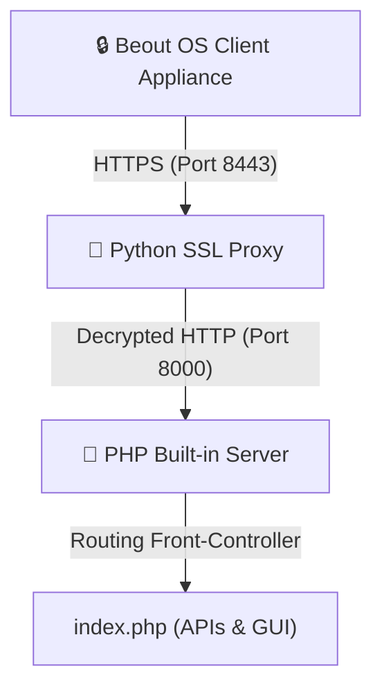

# Beout OS Server — Deployment & Operator Guide

Central Licensing and Update Authority for Beout OS Security Appliances.

## 🚀 How to Deploy on a New Server

Deploying the licensing server is simple, secure, and completely automated. The installer dynamically configures the systemd service based on your system environment, user privileges, and directory structure.

### 1. Clone the Repository
Clone the repository to any directory on your target machine:
```bash
git clone <your-repo-url>
cd Beout_OS/Beout_OS_Server
```

### 2. Run the Dynamic Installer
Make the installer executable and run it:
```bash
chmod +x install-server.sh
sudo ./install-server.sh
```

> **What the Installer Does Automatically:**
> - Detects the non-root owner of the directory (e.g., your local username) to run the service securely without root privileges.
> - Resolves the absolute paths dynamically and writes a custom `/etc/systemd/system/beout-server.service` file.
> - Automatically generates local SSL certificates (`certs/`) and cryptographic keys (`etc/`) if they aren't already present.
> - Spawns a robust, dual-process setup: a PHP backend on `127.0.0.1:8000` and a Python SSL-Termination Proxy on `0.0.0.0:8443`.
> - Enables and starts the service, then runs an active HTTPS health check to verify everything.

---

## 🛡️ Architecture & Security

To maintain maximum portability and zero-dependency overhead, the server uses a highly robust two-process architecture:



1. **Python SSL Proxy (Port 8443):** Terminates TLS traffic securely using standard library socket programming. Handles high-concurrency connections and cleanly tears down sockets.
2. **PHP Built-in Engine (Port 8000):** Runs the front-controller router (`public/index.php`) locally, serving REST APIs and the Operator GUI.
3. **Auto-Recovery Daemon:** The parent script monitors both processes in the background and instantly auto-restarts either if they crash.

---

## 🔄 Applying Updates

When you push updates to your repository, pull them on the server and restart the service to apply:

```bash
cd Beout_OS_Server
git pull
sudo systemctl restart beout-server.service
```

To view real-time logs and verify the server status:
```bash
sudo systemctl status beout-server.service
# Or for system logs:
journalctl -u beout-server.service -f
```

---

## 📌 Handy Aliases

To make management even faster, add these aliases to your `~/.bashrc` or `~/.zshrc`:
```bash
alias beout-restart='sudo systemctl restart beout-server.service'
alias beout-status='sudo systemctl status beout-server.service'
alias beout-logs='journalctl -u beout-server.service -f'
```

---
© 2026 Beout OS — Secure. Portable. Dynamic.